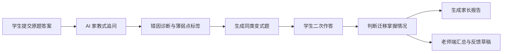

# 作品集案例：高一函数 AI 错题诊断与家长反馈提效工具

## 1. 项目定位

这是一个面向 AI 教育产品实习投递的作品集项目。产品服务对象不是广义学生，而是高一数学家教场景中的三类用户：

- 学生：不愿整理错题，同类题换个条件就不会。
- 家教老师：课后写家长反馈耗时，难以同时服务多个学生。
- 家长：想知道孩子为什么错、怎么监督，而不是只看一次分数。

项目目标：把“错题复盘、变式迁移、家长反馈”从老师手工经验流程，转化为可演示、可保存、可扩展的数据闭环。

## 2. 为什么不是普通搜题工具

普通搜题工具主要解决“这道题怎么做”。本项目更关注“学生为什么错，以及换一道同类题还会不会”。

核心差异：

- 不直接展示答案，而是先进行 AI 家教式追问。
- 不只讲原题，而是生成变式题并要求学生二次作答。
- 不只面向学生，还把结果转化为家长能看懂、老师能复制发送的反馈文案。
- 不只展示页面，而是用 SQLite 保存原题作答、诊断报告和变式作答记录。

## 3. MVP 功能范围

第一版聚焦高一函数 5 个模块：

- 定义域
- 值域
- 单调性
- 奇偶性
- 零点

内置数据：

- 3 个模拟学生：基础薄弱型、概念混淆型、粗心计算型。
- 20 道自建题：每个模块 4 道。
- 错因标签：条件遗漏、边界错误、图像误用、概念表达不规范等。
- 变式模板：支持条件替换和知识点组合扩展。

## 4. 产品流程

## 5. 2 分钟演示路径

1. 进入“AI家教”，选择陈同学和定义域题。
2. 输入错误答案 `x≠3`。
3. 系统诊断为“条件遗漏”，给出追问、提示和补救路径。
4. 生成变式题，学生先输入答案再提交。
5. 系统显示“迁移掌握/仍需巩固”，并展示解析。
6. 进入“家长报告”，查看本次错因、变式迁移情况和可复制反馈。
7. 进入“老师端”，查看学生薄弱点排行、最近变式练习和反馈草稿。

## 6. 技术架构

- 前端：React + Vite，包含学习看板、AI 家教、家长报告、老师端、作品集说明页。
- 后端：Node.js + Express，提供学生、题库、诊断、变式题、报告和老师端汇总接口。
- 数据库：SQLite，保存学生、题库、错因、作答、诊断报告、变式作答。
- AI 模拟层：本地规则引擎，用错因标签、题目模板和学生画像生成追问、提示、诊断和反馈。

## 7. 可扩展方向

如果接入真实 LLM/RAG/Tool Calling，建议拆成以下能力：

- RAG：检索教材知识点、错因库、标准例题和历史学生错题。
- Tool Calling：调用答案校验器、变式题生成器、步骤检查器、报告生成器。
- 学习记忆：长期记录学生常错知识点、提示依赖程度、变式迁移成功率。
- 老师工作台：统计每名学生课后反馈耗时、薄弱点变化、续费风险。

## 8. 商业价值判断

该项目的商业切入点不是替代老师，而是提高家教老师课后服务效率：

- 老师减少重复写反馈的时间。
- 学生获得更稳定的错题复盘和同类题强化。
- 家长获得可理解、可执行的监督建议。
- 小型家教工作室可用标准化反馈提升服务感知。

## 9. 当前局限

- 题库规模较小，只覆盖高一函数。
- 第一版未接真实大模型，诊断能力依赖规则和模板。
- 未做步骤级自动批改，当前主要基于答案匹配和错因标签。
- 缺少真实学生长期学习数据，无法验证实际提分效果。

## 10. 简历表达建议

推荐表述为：

“设计并实现面向高一数学家教场景的 AI 错题诊断与家长反馈提效工具，基于 React + Node.js + SQLite 跑通学生错题作答、AI 家教式追问、错因诊断、变式题二次作答、家长反馈生成和老师端汇总闭环。项目自建 20 道高一函数题库和错因标签体系，通过规则引擎模拟 AI 教学 Agent 能力，并用变式迁移记录验证学生是否真正掌握同类题。”
