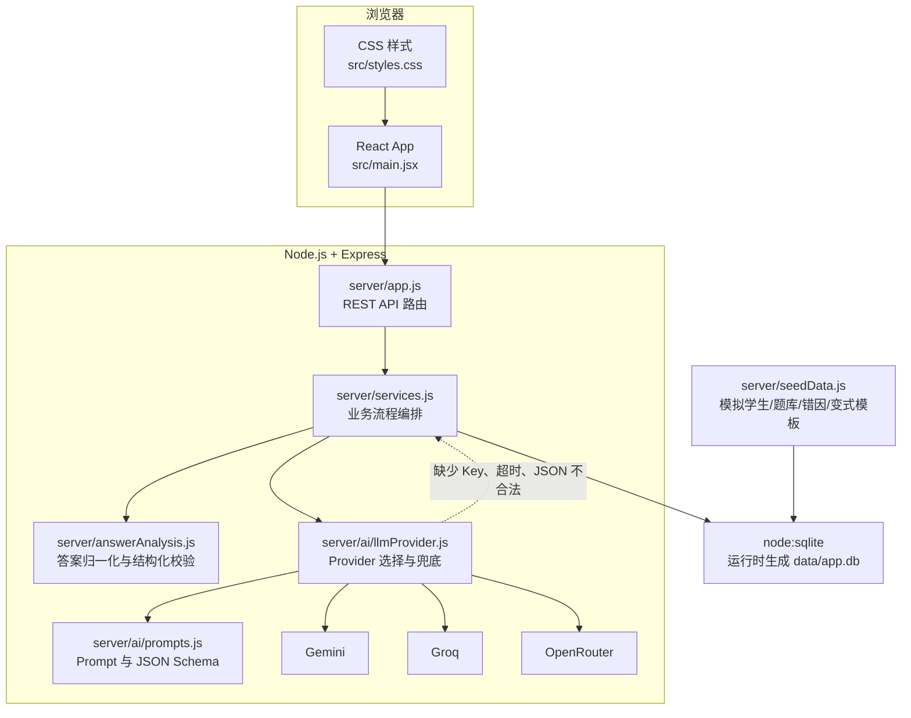
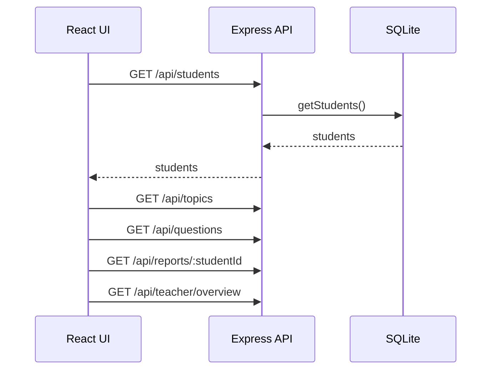
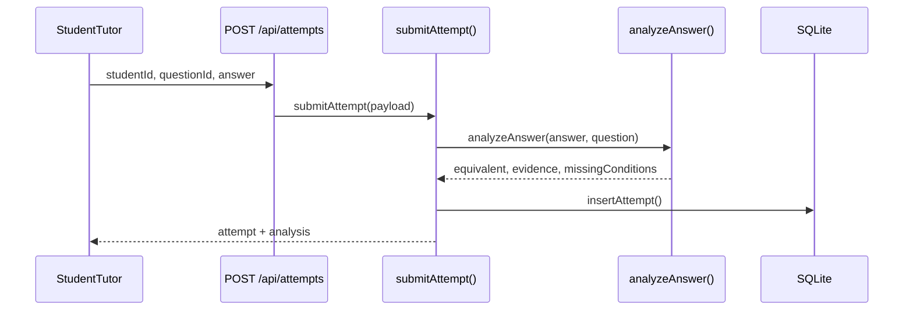
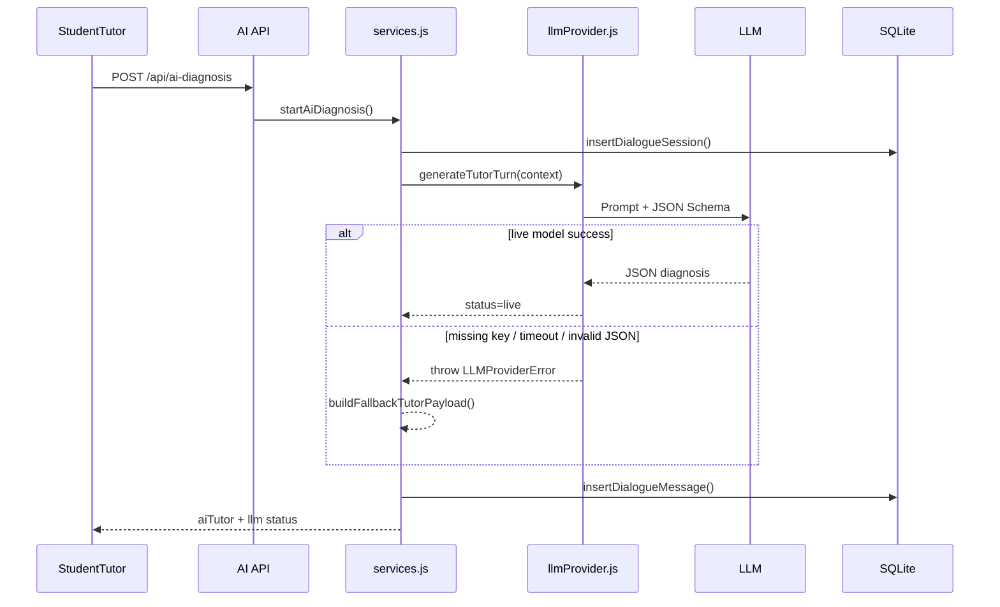

# 技术架构说明

## 1. 架构总览

## 2. 前端模块划分

前端集中在 `src/main.jsx`，用 React 组件组织多个产品视图：

- `App`：维护全局状态，包括当前页面、学生、题目、作答、诊断结果、再练题、报告和老师端概览。
- `Dashboard`：展示学习看板，包括学生画像、最近诊断、变式迁移、知识点掌握和模块题库。
- `StudentTutor`：核心诊断页面，负责题目选择、答案输入、结构化校验结果、AI 追问、学生回应和再练一题。
- `AnswerFeedback` / `AnalysisEvidence`：展示答案是否等价、答案类型、置信度、缺失条件和错因标签。
- `AiDiagnosisSummary` / `PracticeBlock`：展示 AI/规则诊断结论、证据、复习建议和练习题。
- `ParentReport`：展示家长可读报告、下一步监督建议、薄弱知识点、可复制反馈和家长反馈采集。
- `TeacherView`：展示老师待办、学生跟进卡、高频错因、可编辑反馈草稿和最近变式练习。
- `PortfolioCaseStudy`：作品集说明页，解释已验证能力、待验证假设、技术边界和下一步试点。

前端没有引入全局状态库，数据通过组件状态和 REST API 请求流转，适合 MVP 原型快速验证。

## 3. 后端模块划分

- `server/index.js`：读取 `PORT`，启动 Express 服务，默认监听 `127.0.0.1:5174`。
- `server/app.js`：注册 API 路由、JSON body、CORS、AI 限流、demo reset 和生产静态文件托管。
- `server/services.js`：业务中枢，负责作答提交、AI 诊断、追问续轮、诊断报告、变式题、家长报告、老师工作台。
- `server/db.js`：使用 Node 24 内置 `node:sqlite` 创建表、seed 数据和封装读写方法。
- `server/seedData.js`：内置 3 个学生、5 个知识模块、错因标签、20 道题及对应变式模板。
- `server/answerAnalysis.js`：把学生答案归一化，并按题型进行结构化校验。
- `server/ai/prompts.js`：定义 AI 家教系统提示词、诊断 JSON Schema、练习题 JSON Schema 和用户 Prompt 组装。
- `server/ai/llmProvider.js`：根据 `.env` 选择 provider，调用模型，解析 JSON，并在异常时抛出可识别错误。
- `server/ai/providers/`：Gemini、Groq、OpenRouter 的 HTTP 调用实现。

## 4. 数据流

### 4.1 初始加载

首次访问时，后端会调用 `initializeDatabase()`。如果本地数据库为空，会从 `seedData.js` 写入模拟数据；运行时数据保存在 `data/app.db`，该文件被 `.gitignore` 排除。

### 4.2 作答与结构化校验

`answerAnalysis.js` 支持的真实校验范围包括：

- 区间与不等式：如定义域、值域。
- 零点集合：识别 `x=2, x=3` 等答案。
- 坐标点混淆：如把零点写成 `(2,0)`。
- 概念标签：奇函数、偶函数、非奇非偶函数。
- 文本关键模式：单调性题使用关键词匹配。

该校验不是通用 CAS，不承诺覆盖任意数学表达式。

### 4.3 AI 追问与本地降级

多轮追问由 `continueAiFollowup()` 控制。每轮学生回应后，系统递增 `hintLevel`；当提示强度达到 3 时，强制给出完整解析并保存诊断报告。这样可以避免 AI 一开始直接给答案。

## 5. Prompt 与规则逻辑

`AI_TUTOR_SYSTEM_PROMPT` 的关键约束：

- 帮学生理解错误原因，而不是直接替学生完成题目。
- 一次只提出一个问题或提示。
- 连续两轮未解决时增加提示强度。
- 连续三轮未解决时给出完整分步解析。
- 输出必须是结构化 JSON，包含回复、错误类型、诊断、证据、下一问、提示强度、复习建议和练习推荐。

规则兜底逻辑位于 `buildFallbackTutorPayload()`：

- 使用结构化校验证据和错因标签生成追问。
- 根据 `hintLevel` 决定是继续引导还是给出完整解析。
- 结合学生历史诊断记录补充重复错误提示。
- 输出与 LLM 结果一致的数据结构，保证前端展示稳定。

## 6. API 概览

| Method | Path | 作用 |
| --- | --- | --- |
| GET | `/api/health` | 服务健康检查 |
| GET | `/api/students` | 获取模拟学生 |
| GET | `/api/topics` | 获取知识模块 |
| GET | `/api/questions` | 获取题库 |
| POST | `/api/attempts` | 提交原题作答并结构化校验 |
| POST | `/api/diagnose` | 非 LLM 快速诊断/对话起始 |
| POST | `/api/ai-diagnosis` | 启动 AI 家教诊断 |
| POST | `/api/ai-followup` | 继续 AI 多轮追问 |
| POST | `/api/ai-practice` | 生成再练一题 |
| POST | `/api/variants` | 获取本地变式题 |
| POST | `/api/variant-attempts` | 提交变式题答案 |
| GET | `/api/reports/:studentId` | 获取家长报告 |
| GET | `/api/teacher/overview` | 获取老师工作台概览 |
| GET | `/api/teacher/tasks` | 获取老师待办 |
| POST | `/api/feedback-events` | 记录反馈复制/发送事件 |
| POST | `/api/parent-feedback` | 记录家长反馈 |
| POST | `/api/demo/reset` | 重置演示数据库 |

## 7. 环境变量

| 变量 | 用途 | 是否必需 |
| --- | --- | --- |
| `PORT` | 后端端口，默认 `5174` | 否 |
| `LLM_PROVIDER` | 可选 `gemini`、`groq`、`openrouter` | 否 |
| `LLM_TIMEOUT_MS` | 模型请求超时时间 | 否 |
| `AI_RATE_LIMIT_PER_MINUTE` | AI 接口每分钟限流 | 否 |
| `GEMINI_API_KEY` / `GROQ_API_KEY` / `OPENROUTER_API_KEY` | 对应模型 API Key | 否 |
| `GEMINI_MODEL` / `GROQ_MODEL` / `OPENROUTER_MODEL` | 对应模型名称 | 否 |

没有 API Key 时，项目仍可运行，并会在页面显示“本地规则降级”。

## 8. 当前技术限制

- 结构化校验覆盖高一函数常见答案形态，不是通用数学 CAS。
- 题库为自建小样本，仅覆盖 5 个函数模块和 20 道题。
- 数据库为本地 SQLite，没有登录、多用户隔离或云端同步。
- LLM 调用只做 JSON 结构化输出，没有 RAG、工具调用或步骤级证明检查。
- 老师端的提效指标来自本地事件记录和演示基准，不能等同真实业务效果。

## 9. 下一步可迭代方向

- 增加步骤级批改，把最终答案校验扩展到中间步骤识别。
- 为每个知识点补充教材讲义、错因样例和标准例题，接入 RAG 检索。
- 把答案校验器封装为 Tool Calling，让 LLM 必须先调用规则工具再生成诊断。
- 增加真实老师使用日志，验证反馈生成时间、编辑时间、发送率和家长满意度。
- 加入更多题型和边界测试，提高结构化校验的可解释性与稳定性。

