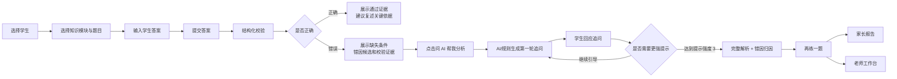

# 产品流程说明

## 1. 目标用户

本原型面向高一数学函数学习中的三个角色：

- 学生：做错题后不知道自己错在哪里，同类题换条件后容易再次出错。
- 家教老师/辅导老师：课后需要复盘错题、布置同类练习、给家长反馈，但手工整理成本高。
- 家长：希望看懂孩子为什么错、下一步怎么监督，而不是只看分数或标准答案。

## 2. 典型使用场景

1. 学生做完一道高一函数题，输入自己的答案。
2. 系统先判断答案是否与参考答案等价，并指出缺失条件或错因候选。
3. 如果答错，学生可以启动 AI 家教追问。
4. AI/规则诊断不直接给完整答案，而是先追问一个关键点。
5. 学生回应后，系统逐步增加提示强度；多轮仍未解决时才给完整解析。
6. 系统生成同知识点、相近难度的再练题，验证学生是否真正迁移。
7. 家长报告和老师工作台同步更新，沉淀错因、薄弱点和反馈文案。

## 3. 核心用户路径

## 4. 页面与问题对应关系

| 页面 | 解决的问题 | 关键交互 |
| --- | --- | --- |
| 学习看板 | 老师快速了解学生画像、近期诊断、知识点掌握和变式迁移情况 | 切换学生、查看统计和模块题库 |
| 诊断 Copilot | 学生完成原题作答、结构化校验、AI 追问和再练一题 | 选择题目、输入答案、问 AI、回应追问、生成练习 |
| 家长报告 | 把错题诊断转成家长能读懂的监督建议 | 查看错因、复制反馈、提交家长反馈 |
| 老师工作台 | 把多个学生的课后跟进整理为待办和反馈草稿 | 查看待办、复制草稿、标记已发送 |
| 验证说明 | 面向 HR/面试官解释原型能力、边界和下一步验证假设 | 阅读作品集定位和技术边界 |

## 5. 如何避免“只给答案”

项目的教学链路刻意把“直接答案”放在较后阶段：

1. 先做结构化校验，不马上展示完整解析，而是告诉学生答案缺了什么条件。
2. AI Prompt 明确要求“一次只提出一个问题或提示”，先引导学生自己发现错误。
3. 多轮追问中用 `hintLevel` 控制提示强度，学生连续无法解决时才给完整解析。
4. 最终诊断必须包含错误类型、证据、复习建议和相似练习推荐，而不是只输出标准答案。
5. 再练一题用于验证迁移，避免学生只是记住原题答案。
6. 家长报告关注“为什么错、怎么监督、是否迁移”，而不是展示一段泛化讲解。

## 6. 当前演示路径

推荐 2-3 分钟演示：

1. 进入“诊断 Copilot”。
2. 保持默认学生“陈同学”，选择“定义域 / 根式与分式组合定义域”。
3. 输入常见错误答案：`x≠3`。
4. 点击“提交答案”，查看“缺少 x≥1”的结构化校验证据。
5. 点击“问 AI 帮我分析”，查看本地规则降级或模型实时生成的追问。
6. 输入学生回应，连续两轮后查看完整解析、错因归因和复习建议。
7. 点击“再练一题”，查看同知识点练习题。
8. 切换到“家长报告”和“老师工作台”，查看报告与待办如何同步更新。

## 7. 可观察的产品价值

- 对学生：从“我做错了”转变为“我知道错在哪一步、下一题要检查什么”。
- 对老师：把错题诊断、变式巩固、家长反馈整理成可复用流程。
- 对家长：获得可理解、可执行的监督建议，而不是抽象评价。
- 对 AI 产品验证：把 LLM 能力限制在可控的诊断 JSON 输出中，并保留本地规则兜底。

## 8. 未覆盖的真实场景

- 暂未支持学生拍照上传手写作答。
- 暂未支持任意高中数学题，只覆盖内置高一函数题。
- 暂未验证真实老师长期使用后的效率提升。
- 暂未做账号体系、班级管理或云端部署。

